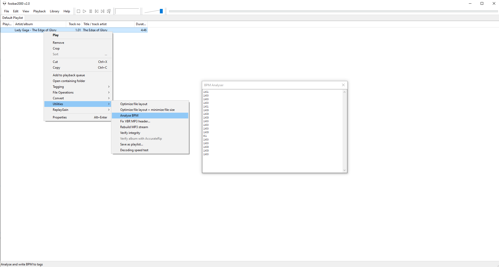

# foo_cnn_bpm

Foobar2000 plugin to analyse bpm for tracks. Based on the work of hendrik73's [tempo-cnn](https://github.com/hendriks73/tempo-cnn) and using one of his models.

Currently this will attempt to make a series of BPM predictions but it cannot write any BPM information to tags (yet).

Requires a copy of the tensorflow c api v1.x dll to also be located within the foobar install directory.
